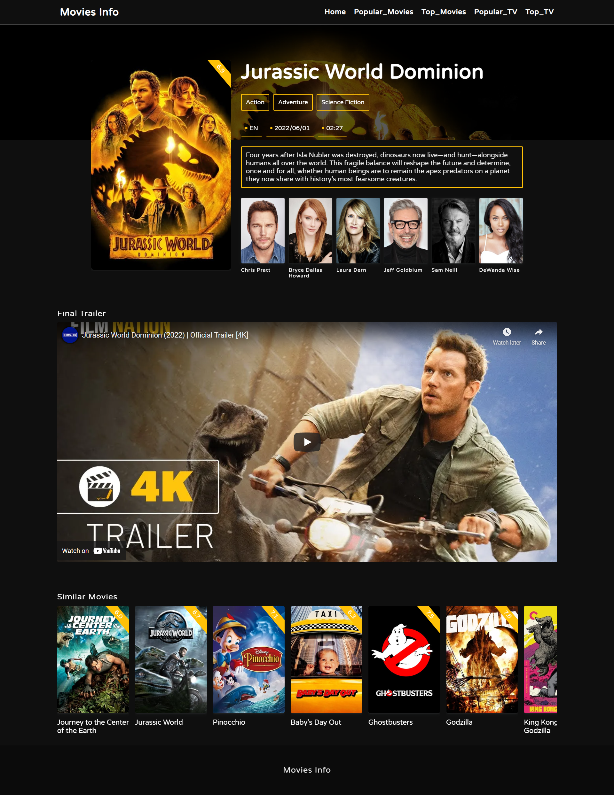

# Movies Info 🎥  

Movies Info is an app where you can view details of your favourite TV Shows and Movies, it is similar to IMDB.

### Built Using
- HTML with JSX
- CSS with SCSS
- JavaScript with Typescript 
- ReactJs
- Axios
- SwiperJs
- Bootstrap Icons
- TMDB API

### How to Run the Project
- Download the code and open it in your text editor
- Create a .env file and add API key as REACT_APP_MY_API_KEY=YOUR_API_KEY
- Run "npm i" in your command line
- Run "npm start" in your command line
